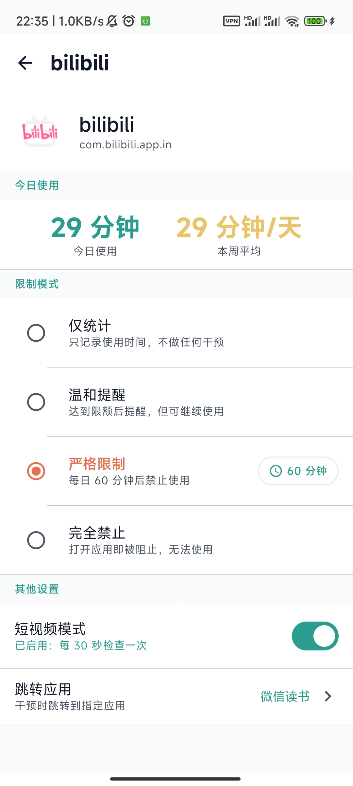
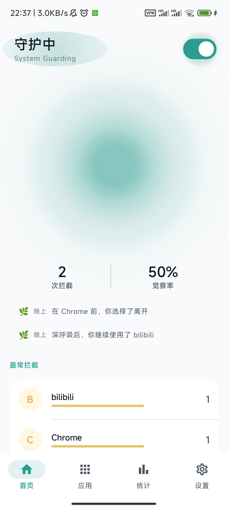
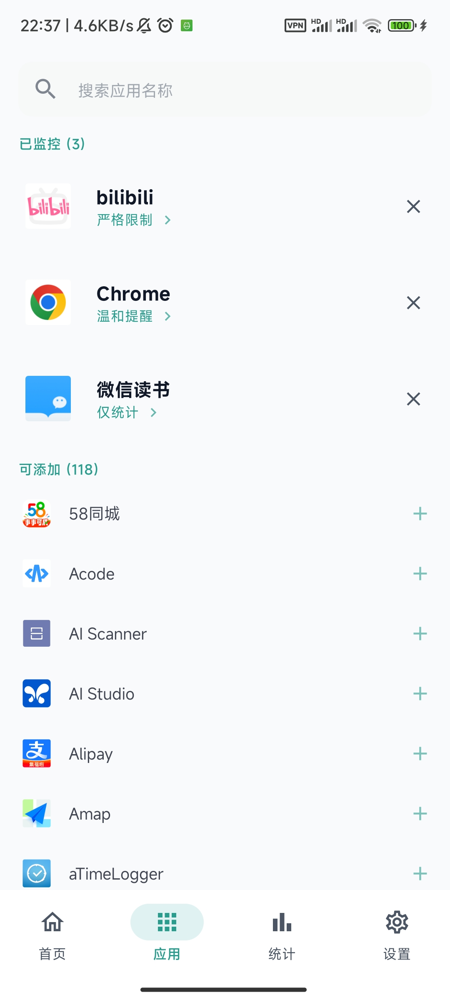
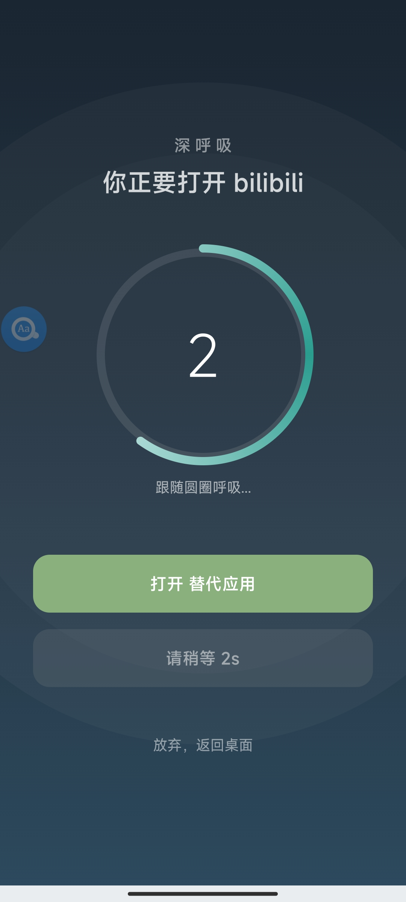

# SlowDown

  

  **在你刷手机的过程中，轻轻拍一下你的肩膀**

  
  

---

## 这是什么？

SlowDown 是一款帮助你觉察手机使用的 Android 应用。

**它不会在你打开应用时拦截你**。它等待着，在你刷了一段时间后，在你已经陷入无意识滑动的时候，温柔地弹出一个深呼吸界面，让你暂停几秒。这短短的几秒，足以让你意识到时间在流逝，然后做出更好的选择。

**不是阻止你开始，而是帮你在沉浸中清醒。**

---

## 为什么选择 SlowDown？

### 与其他限时应用的区别

| 特点 | SlowDown | 其他应用 |
|------|----------|----------|
| **干预时机** | 使用过程中定期提醒 | 打开时就拦截 |
| **干预方式** | 深呼吸等待，温柔提醒 | 直接锁死，强制禁用 |
| **隐私保护** | 数据全部存在本地，不联网 | 通常需要注册账号、云同步 |
| **使用体验** | 尊重用户选择，可随时继续 | 常有"绕过限制"的挫败感 |
| **设计理念** | 在沉浸中唤醒觉察 | 把用户当敌人 |

### 核心理念

- **过程中觉察**：问题不是"你该不该打开"，而是"你刷了多久还没意识到"
- **不制造焦虑**：没有恐吓式的"你已浪费 X 小时"，只有平静的深呼吸
- **尊重选择**：深呼吸后可以继续使用，决定权始终在你手中

---

## 功能介绍

### 四种限制模式

为每个应用选择合适的限制力度：

| 模式 | 说明 |
|------|------|
| **仅统计** | 只统计时间，不做干预 |
| **温和提醒** | 达到阈值后弹出深呼吸提醒，可继续使用 |
| **严格限制** | 达到限额后强制停止，今日无法继续 |
| **完全禁止** | 打开即阻止，无法使用 |

### 深呼吸干预界面

- 跟随呼吸圆进行深呼吸
- 倒计时结束后可选择继续或离开
- 可设置跳转到替代应用（如：刷够了抖音 → 去看书）
- 可添加自定义提醒语激励自己

### 使用时间追踪

- 为每个应用设置每日限额（1-1440 分钟）
- 使用达到 80% 时温柔提醒
- 使用达到 100% 时根据模式决定是否强制

### 冷却时间机制

- 全局冷却：1-30 分钟可调（默认 5 分钟）
- 每个应用可单独设置冷却时间
- 避免频繁打扰，保持提醒的有效性

### 短视频模式

针对抖音、B站等刷视频应用，开启后每 30 秒主动检查使用状态，确保深呼吸提醒能正常触发。

### 使用统计

- 今日使用时长和拦截次数
- 觉察率（选择放弃使用的比例）
- 本周使用趋势

### 截图

  
  
  
  

---

## 如何使用

### 1. 安装并授权

安装后需要开启以下权限：

**必要权限**

| 权限 | 作用 |
|------|------|
| 无障碍服务 | 检测应用切换 |
| 悬浮窗权限 | 显示深呼吸界面 |
| 使用情况访问 | 读取应用使用时间 |

**MIUI 用户额外设置**

小米手机需要额外开启：
- 自启动权限
- 后台弹出界面权限
- 电池设置为"无限制"

### 2. 添加监控应用

1. 打开 SlowDown，进入「应用」页面
2. 点击想要监控的应用
3. 设置限制模式和每日时间限额

### 3. 开始使用

设置完成后，正常使用手机即可。SlowDown 会在后台追踪使用时间，**只有当使用达到阈值时才会提醒你**。

---

## 常见问题

**Q: 为什么不直接锁死应用？**

A: 强制戒断容易引发逆反心理。SlowDown 的目标是帮你建立觉察，而不是和你作对。

**Q: 刷短视频时为什么没有提醒？**

A: 请在应用设置中开启「视频应用模式」，启用 30 秒定时检查。

**Q: 弹窗等待时间可以调整吗？**

A: 可以，在设置中调整默认倒计时秒数（3-30秒）。

**Q: 会影响电话和短信吗？**

A: 不会。系统应用和关键功能自动排除，不会被干预。

**Q: 我的数据安全吗？**

A: 所有数据都存储在本地，不会上传到任何服务器。

---

## 技术栈

- **语言**: Kotlin
- **UI**: Jetpack Compose + Material 3
- **架构**: MVVM + Repository
- **数据**: Room + DataStore
- **最低支持**: Android 8.0 (API 26)

---

## 文档

| 文档 | 说明 |
|------|------|
| [功能说明书](docs/function.md) | 用户操作手册，详细介绍各项功能 |
| [技术架构](docs/architecture.md) | 系统设计与实现细节 |
| [问题排查](docs/troubleshooting.md) | 常见问题与已修复的 Bug |
| [开发指南](CONTRIBUTING.md) | 代码规范、Git 工作流、发布流程 |
| [更新日志](CHANGELOG.md) | 版本历史与功能路线图 |

---

## 开源协议

本项目基于 MIT 协议开源。

---

  少刷一点，多活一点

