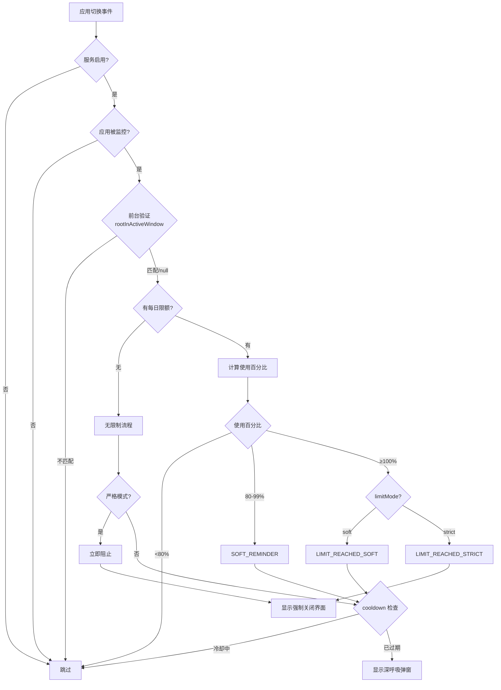

# SlowDown 技术架构文档

## 概述

SlowDown 是一款基于 Android AccessibilityService 的应用监控系统，通过事件驱动 + 定时轮询的混合架构实现实时监控和干预。

**核心技术栈**：
- Kotlin + Jetpack Compose
- AccessibilityService（应用切换监听）
- UsageStatsManager（使用时间追踪）
- Room Database + DataStore（数据持久化）

---

## 系统架构

```
┌─────────────────────────────────────────────────────────────┐
│                      UI Layer (Compose)                      │
│   DashboardScreen │ AppListScreen │ AppDetailScreen │ Settings │
└──────────────────────────┬──────────────────────────────────┘
                           │
┌──────────────────────────┴──────────────────────────────────┐
│                     ViewModel Layer                          │
│   DashboardViewModel │ AppListViewModel │ AppDetailViewModel │
└──────────────────────────┬──────────────────────────────────┘
                           │
┌──────────────────────────┴──────────────────────────────────┐
│                    Repository Layer                          │
│            AppRepository │ UsageRecordRepository             │
└──────────────────────────┬──────────────────────────────────┘
                           │
           ┌───────────────┴───────────────┐
           ▼                               ▼
┌─────────────────────┐         ┌─────────────────────────────┐
│   Service Layer     │         │      Data Layer             │
│                     │         │                             │
│  AppMonitorService  │◄───────►│  Room Database              │
│  (Accessibility)    │         │  ├── MonitoredApp           │
│                     │         │  ├── UsageRecord            │
│  UsageTracking      │         │  └── InterventionRecord     │
│  Manager            │         │                             │
└─────────────────────┘         │  DataStore Preferences      │
                                └─────────────────────────────┘
```

---

## 核心组件

### 1. AppMonitorService

**文件位置**：`service/AppMonitorService.kt`

AccessibilityService 实现，系统核心入口。

**职责**：
- 监听 `TYPE_WINDOW_STATE_CHANGED` 事件
- 维护前台应用追踪状态
- 管理冷却时间映射
- 协调干预弹窗触发

**关键状态变量**：

| 变量 | 类型 | 用途 |
|------|------|------|
| `currentForegroundApp` | String? | 当前前台应用包名 |
| `foregroundStartTime` | Long | 前台开始时间戳 |
| `cooldownMap` | ConcurrentHashMap<String, Long> | 应用冷却时间记录 |
| `shownLimitWarningToday` | MutableSet<String> | 今日已显示100%警告的应用 |
| `currentVideoApp` | String? | 当前定时检查的视频应用 |

**事件处理流程**：

```kotlin
onAccessibilityEvent(event)
    ↓
验证包名（非 SlowDown 自身、非系统应用）
    ↓
rootInActiveWindow 二次验证真实前台
    ↓
handleRealtimeTracking（记录使用时间）
    ↓
checkAndShowUsageWarning（触发干预判定）
```

### 2. UsageTrackingManager

**文件位置**：`service/UsageTrackingManager.kt`

使用时间追踪管理器。

**职责**：
- 从 UsageStatsManager 同步使用数据
- 动态调整同步间隔
- 实时追踪高使用率应用
- 计算警告类型

**同步策略**：
- 默认间隔：5 分钟
- 短间隔：1 分钟（限额 < 10 分钟 或 使用 ≥ 80%）

**实时追踪**：
- 触发条件：使用 ≥ 70% 限额
- 精度：记录应用内实际停留时长
- 缓冲：不足 1 分钟的时间累积后批量更新

### 3. OverlayActivity

**文件位置**：`ui/overlay/OverlayActivity.kt`

深呼吸干预界面。

**触发条件**：
- 无限制应用（软模式）+ cooldown 到期
- 使用达到 80-99%
- 使用达到 100%（软模式）

**UI 元素**：
- 呼吸动画圆环（4 秒循环）
- 倒计时（3-30 秒可配置）
- 自定义提醒语
- 操作按钮：继续使用 / 跳转替代 / 返回桌面

### 4. UsageWarningActivity

**文件位置**：`ui/overlay/UsageWarningActivity.kt`

强制关闭警告界面。

**触发条件**：
- 使用达到 100%（严格模式）
- 无限制 + 严格模式（完全禁止）

**特点**：
- 无"继续使用"选项
- 按返回键强制返回桌面

---

## 干预触发决策树



---

## 冷却时间机制

### 数据结构

```kotlin
cooldownMap: ConcurrentHashMap<String, Long>
// packageName → 上次触发时间戳(ms)
```

### 检查逻辑

```kotlin
fun checkCooldown(packageName: String): Boolean {
    val lastTime = cooldownMap[packageName] ?: 0L
    val cooldownMinutes = app.cooldownMinutes ?: globalCooldown
    val cooldownMs = cooldownMinutes * 60 * 1000L
    val elapsed = System.currentTimeMillis() - lastTime
    return elapsed >= cooldownMs
}
```

### 适用范围

| 场景 | 受 cooldown 控制 |
|------|-----------------|
| 深呼吸弹窗（SOFT_REMINDER） | ✅ 是 |
| 100% 软模式（LIMIT_REACHED_SOFT） | ✅ 是 |
| 无限制 + 软模式 | ✅ 是 |
| 视频应用定时检查 | ✅ 是 |
| 强制关闭（LIMIT_REACHED_STRICT） | ❌ 否，每次都触发 |
| 完全禁止模式 | ❌ 否，每次都触发 |

### 内存管理

1 小时周期清理 24 小时以上未更新的条目，防止内存泄漏。

---

## 视频应用特殊处理

### 问题背景

短视频应用（抖音、B站等）在刷视频时不触发 `TYPE_WINDOW_STATE_CHANGED` 事件，因为视频切换使用 ViewPager2/RecyclerView 实现，不涉及 Activity 切换。

### 解决方案

```kotlin
// 标记为视频应用
MonitoredApp(isVideoApp = true)

// 启动 30 秒定时器
private val videoAppCheckHandler = Handler(Looper.getMainLooper())
private val videoAppCheckRunnable = object : Runnable {
    override fun run() {
        checkVideoAppUsage()
        videoAppCheckHandler.postDelayed(this, 30_000L)
    }
}
```

### 前台验证策略

```kotlin
val actualForeground = rootInActiveWindow?.packageName?.toString()
when {
    actualForeground == targetApp -> // 正常匹配，继续检查
    actualForeground == null -> // 可能是全屏视频，仍继续检查
    else -> stopVideoAppCheck() // 明确切换到其他应用，停止定时器
}
```

---

## MIUI 兼容性处理

### 问题：AccessibilityService 被冻结

MIUI 会冻结后台应用的 AccessibilityService 进程，导致事件无法被接收。

### 解决方案

**1. 前台服务通知**

```kotlin
override fun onServiceConnected() {
    val notification = NotificationHelper.buildForegroundNotification(this)
    if (Build.VERSION.SDK_INT >= Build.VERSION_CODES.UPSIDE_DOWN_CAKE) {
        ServiceCompat.startForeground(
            this,
            FOREGROUND_NOTIFICATION_ID,
            notification,
            ServiceInfo.FOREGROUND_SERVICE_TYPE_SPECIAL_USE
        )
    } else {
        startForeground(FOREGROUND_NOTIFICATION_ID, notification)
    }
}
```

**2. AndroidManifest 配置**

```xml
<service
    android:name=".service.AppMonitorService"
    android:foregroundServiceType="specialUse"
    ...>
    <property
        android:name="android.app.PROPERTY_SPECIAL_USE_FGS_SUBTYPE"
        android:value="accessibility_monitoring" />
</service>
```

---

## 数据模型

### MonitoredApp（被监控应用）

```kotlin
@Entity(tableName = "monitored_apps")
data class MonitoredApp(
    @PrimaryKey val packageName: String,
    val appName: String,
    val isEnabled: Boolean = true,           // 监控开关
    val dailyLimitMinutes: Int? = null,      // 每日限额（null=无限制）
    val limitMode: String = "soft",          // "soft" 或 "strict"
    val isVideoApp: Boolean = false,         // 短视频应用标记
    val redirectPackage: String? = null,     // 替代应用包名
    val cooldownMinutes: Int? = null         // 应用独有冷却（null=使用全局）
)
```

### UsageRecord（使用记录）

```kotlin
@Entity(tableName = "usage_records", primaryKeys = ["packageName", "date"])
data class UsageRecord(
    val packageName: String,
    val date: String,           // "yyyy-MM-dd"
    val usageMinutes: Int = 0,
    val lastUpdated: Long = 0
)
```

### InterventionRecord（干预记录）

```kotlin
@Entity(tableName = "intervention_records")
data class InterventionRecord(
    @PrimaryKey(autoGenerate = true) val id: Long = 0,
    val packageName: String,
    val appName: String,
    val timestamp: Long,
    val interventionType: String,   // "countdown"
    val userChoice: String,         // "continued", "redirected", "cancelled"
    val countdownDuration: Int,
    val actualWaitTime: Int
)
```

---

## 关键配置参数

### 全局设置

| 参数 | 范围 | 默认值 | 说明 |
|------|------|--------|------|
| defaultCountdown | 3-30 秒 | 10 秒 | 深呼吸倒计时 |
| globalCooldown | 1-30 分钟 | 5 分钟 | 弹窗间隔 |
| customReminder | 文本 | 空 | 自定义提醒语 |

### 应用设置

| 参数 | 范围 | 默认值 | 说明 |
|------|------|--------|------|
| dailyLimitMinutes | 1-1440 分钟 | null | 每日限额 |
| limitMode | soft/strict | soft | 限制模式 |
| cooldownMinutes | 1-30 分钟 | null（使用全局） | 应用独有冷却 |
| isVideoApp | 布尔 | false | 短视频模式 |

---

## 性能优化

1. **防抖动**：500ms 内同一应用不重复检查
2. **动态同步间隔**：根据使用率调整（5分钟 ↔ 1分钟）
3. **缓存语言设置**：避免 attachBaseContext 中的 I/O 阻塞
4. **Map 定期清理**：防止内存泄漏
5. **异步加载提醒语**：500ms 超时，避免 UI 卡顿

---

## 边缘情况处理

### 1. rootInActiveWindow 返回 null

全屏视频播放（SurfaceView/TextureView）或 WebView 渲染时可能返回 null。

**处理策略**：null 时仍继续检查，不等同于"用户离开"。

```kotlin
when {
    actualForeground == targetApp -> checkWarning()
    actualForeground == null -> checkWarning()  // 特殊 UI 状态
    else -> skip()  // 明确切换到其他应用
}
```

### 2. 异步延迟导致误触发

在弹窗启动前进行最终验证：

```kotlin
private fun launchDeepBreathOverlay(packageName: String) {
    val actualForeground = rootInActiveWindow?.packageName?.toString()
    if (actualForeground != null && actualForeground != packageName) {
        return  // 前台已变化，跳过
    }
    // 继续启动弹窗
}
```

### 3. 每日重置

每天零点重置 `shownLimitWarningToday` 集合。

---

## 权限要求

| 权限 | 用途 |
|------|------|
| BIND_ACCESSIBILITY_SERVICE | AccessibilityService 基础 |
| SYSTEM_ALERT_WINDOW | 弹窗显示 |
| PACKAGE_USAGE_STATS | 使用时间获取 |
| FOREGROUND_SERVICE | 前台服务（MIUI 防冻结） |
| POST_NOTIFICATIONS | 前台服务通知 |

---

*最后更新：2026-01-20*
