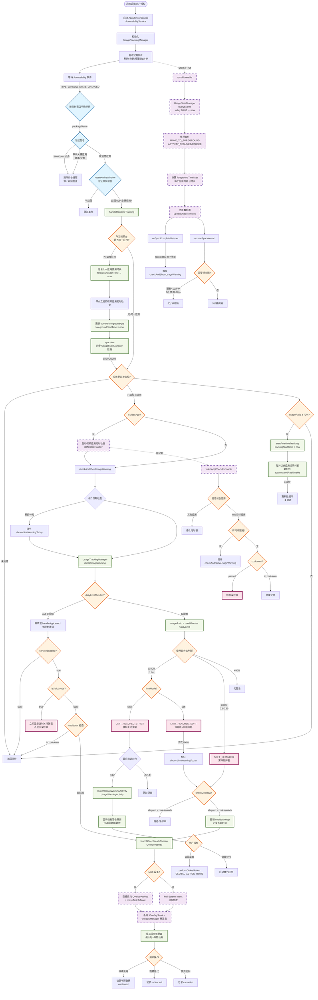
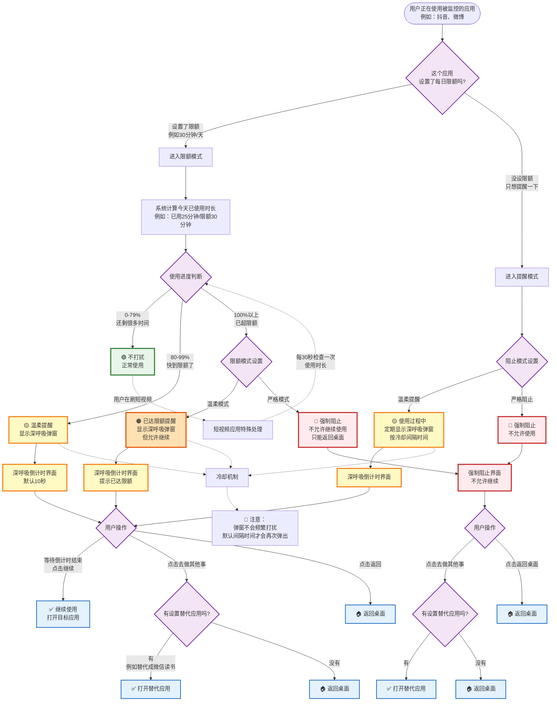

## 📊 SlowDown 应用监控与弹窗触发机制 - Ultra 综合分析

  第一部分：问题重构（Problem Reconceptualization）

  原始问题

  画一幅详细流程图，这个软件里，程序怎么实现监控软件并触发弹窗的逻辑（包括怎么检测和触发判定条件）

  精炼后的问题

  核心问题：SlowDown 如何在 Android 系统中实时检测被监控应用的启动和使用时间，并根据多维度规则（时间限额、使用百分比、冷却时间、应用类型）触发不同类型的干预弹窗？

  隐含假设发掘

  1. 假设1：你可能认为监控是通过轮询检查当前运行应用实现的

    - 实际：使用 Android AccessibilityService 的事件驱动机制
  2. 假设2：弹窗触发是简单的时间阈值判断

    - 实际：涉及多层决策树（限额模式/百分比/冷却时间/应用类型）
  3. 假设3：使用时间统计是实时追踪的

    - 实际：混合策略 - UsageStatsManager 定期同步 + 关键时刻实时追踪

---
  第二部分：核心架构流程图

---
  第三部分：多维度深度分析

  1. 核心组件架构（Component Architecture）

  1.1 AppMonitorService (AccessibilityService)

  职责：
  - 监听系统窗口切换事件（TYPE_WINDOW_STATE_CHANGED）
  - 维护前台应用追踪状态（currentForegroundApp, foregroundStartTime）
  - 管理冷却时间映射（cooldownMap: ConcurrentHashMap<String, Long>）
  - 协调触发决策逻辑

  关键机制：
  onAccessibilityEvent(event)
    ↓
  验证包名合法性（非 SlowDown 自身、非系统应用）
    ↓
  rootInActiveWindow 二次验证真实前台（防误触发）
    ↓
  handleRealtimeTracking（记录使用时间）
    ↓
  handleAppLaunch（触发干预判定）

  1.2 UsageTrackingManager

  职责：
  - 从 UsageStatsManager 同步精确使用数据（queryEvents API）
  - 动态调整同步间隔（5分钟 ↔ 1分钟）
  - 实时追踪高使用率应用（≥70% 启用）
  - 计算警告类型（SOFT_REMINDER / LIMIT_REACHED_SOFT / LIMIT_REACHED_STRICT）

  同步策略：
  queryEvents(today 00:00, now)
    ↓
  遍历 ACTIVITY_RESUMED/PAUSED 事件对
    ↓
  计算每个应用的前台停留时长（foregroundTimeMap）
    ↓
  处理未关闭的前台应用（now - foregroundStart）
    ↓
  更新数据库 usageMinutes
    ↓
  触发 onSyncCompleteListener → 检查当前前台是否需要警告

  1.3 视频应用特殊处理机制

  问题：短视频应用（抖音/快手）在刷视频时不触发窗口切换事件
  解决方案：
  标记 isVideoApp = true
    ↓
  启动 Handler 定时器（30秒间隔）
    ↓
  videoAppCheckRunnable：
    - 验证前台仍是目标应用（允许 null 情况-全屏视频）
    - 检查 cooldown 并主动触发弹窗
    - 用户切换应用时自动停止定时器

---
  2. 触发条件决策树（Decision Tree）

  ┌─────────────────────────────────────────────┐
  │          应用打开/使用时间更新              │
  └─────────────┬───────────────────────────────┘
                │
                ▼
        ┌───────────────┐
        │ 服务是否启用？ │
        └───┬───────┬───┘
            NO      YES
            │       │
          跳过      ▼
            ┌───────────────┐
            │ 应用是否被监控？│
            └───┬───────┬───┘
                NO      YES
                │       │
              跳过      ▼
                ┌───────────────────┐
                │ 当前前台是否匹配？ │
                │(rootInActiveWindow)│
                └───┬───────┬───────┘
                    NO      YES/null
                    │       │
                  跳过      ▼
                    ┌─────────────────┐
                    │ 有时间限额吗？   │
                    └───┬─────────┬───┘
                        NO        YES
                        │         │
                ┌───────┘         └───────┐
                │                           │
                ▼                         ▼
      ┌──────────────────┐      ┌──────────────────┐
      │  无限制模式决策                     │      │  限额模式决策     │
      └─────────┬────────┘      └─────────┬────────┘
                │                         │
          ┌─────┴─────┐             ┌─────┴─────┐
          │           │             │           │
     limitMode?   limitMode?   使用百分比?   使用百分比?
     strict       soft           <80%        ≥80%
          │           │             │           │
          ▼           ▼             │       ┌───┴───┐
     立即强制    cooldown         跳过     80-99%  ≥100%
     关闭弹窗    检查                       │       │
          │           │                     ▼       ▼
          │           ▼                 深呼吸   limitMode?
          │      深呼吸弹窗                │   strict  soft
          │           │                   │     │      │
          └───────────┴───────────────────┴─────┴──────┘
                              │
                              ▼
                      ┌───────────────┐
                      │ cooldown 检查 │
                      └───┬───────┬───┘
                          │       │
                     已过期   冷却中
                          │       │
                          ▼       ▼
                    触发弹窗    跳过

  关键阈值：
  - 70%: 启动实时追踪（每次切换应用记录时长）
  - 80%: 触发 SOFT_REMINDER（深呼吸弹窗）
  - 100%:
    - soft 模式 → LIMIT_REACHED_SOFT（深呼吸+限额风格，首次标记）
    - strict 模式 → LIMIT_REACHED_STRICT（强制关闭）

---
  3. 冷却机制（Cooldown System）

  数据结构：
  cooldownMap: ConcurrentHashMap<String, Long>
  // packageName → 上次触发时间戳(ms)

  检查逻辑：
  val lastTime = cooldownMap[packageName] ?: 0
  val cooldownMs = cooldownMinutes * 60 * 1000L
  val elapsed = System.currentTimeMillis() - lastTime
  if (elapsed >= cooldownMs) {
      // 可以触发
      cooldownMap[packageName] = System.currentTimeMillis()
      launchPopup()
  }

  适用场景：
  - ✅ 深呼吸弹窗（SOFT_REMINDER / LIMIT_REACHED_SOFT）
  - ✅ 无限制+软模式
  - ✅ 视频应用主动检查
  - ❌ 强制关闭弹窗（每次都触发）

  重要：100% 软模式首次标记到 shownLimitWarningToday，之后仍受 cooldown 控制，不是"仅一次"。

---
  4. 弹窗显示策略（Popup Display Strategy）

  4.1 深呼吸弹窗（OverlayActivity）

  触发条件：
  - 无限制应用（软模式）
  - 80-99% 使用率
  - 100% 软模式

  显示方式：
  MIUI 设备：
    1. 直接启动 Activity + FLAG_NEW_TASK
    2. Handler 多次调用 moveTaskToFront（0ms, 100ms, 300ms）
    3. 备用：OverlayService (WindowManager.addView)

  非 MIUI 设备：
    1. Full-Screen Intent（通知触发）
    2. 备用：OverlayService

  UI 元素：
  - 呼吸动画圆环（4秒循环，scale 1.0 ↔ 1.15）
  - 倒计时（默认 10 秒，可配置）
  - 操作按钮：
    - 继续使用（倒计时结束后可用）
    - 跳转替代应用（如配置）
    - 返回桌面

  4.2 强制关闭弹窗（UsageWarningActivity）

  触发条件：
  - 100% + strict 模式
  - 无限制 + strict 模式

  UI 特点：
  - 不允许继续使用
  - 仅提供：返回桌面/跳转替代应用
  - 按返回键 → 强制返回桌面

---
  5. MIUI 兼容性处理（MIUI Compatibility）

  问题：MIUI 会冻结后台 AccessibilityService 进程

  解决方案：
  // 1. 前台服务通知（防冻结）
  startForeground(
      NotificationHelper.FOREGROUND_NOTIFICATION_ID,
      notification,
      FOREGROUND_SERVICE_TYPE_SPECIAL_USE
  )

  // 2. 直接启动 Activity + moveTaskToFront（绕过系统限制）
  ActivityManager.moveTaskToFront(taskId, MOVE_TASK_WITH_HOME)
  // 延迟重试 3 次（0ms, 100ms, 300ms）

  // 3. MIUI 特定 Intent 标志
  MiuiHelper.addMiuiFlags(intent)

---
  6. 边缘情况处理（Edge Cases）

  6.1 全屏视频播放

  问题：rootInActiveWindow?.packageName 返回 null
  处理：
  if (actualForeground == null) {
      Log.d(TAG, "Foreground is null (fullscreen video?), proceeding anyway")
      // 仍然继续检查，不跳过
  }

  6.2 异步延迟导致误触发

  解决：在 launchOverlay 和 launchWarning 前最后验证：
  val actualForeground = rootInActiveWindow?.packageName?.toString()
  if (actualForeground != null && actualForeground != targetPackage) {
      Log.d(TAG, "Skip - foreground changed")
      return
  }

  6.3 同步回调触发检查

  UsageTrackingManager.onSyncCompleteListener：
  if (actualForeground == currentFg || actualForeground == null) {
      checkAndShowUsageWarning(currentFg)
  }
  防止在 SlowDown 自身界面或其他应用时误触发。

---
  第四部分：数据流与状态管理

  关键状态变量
  ┌───────────────────────────┬──────────────────────┬──────────────────────────────┐
  │           变量            │        作用域        │             用途             │
  ├───────────────────────────┼──────────────────────┼──────────────────────────────┤
  │ currentForegroundApp      │ AppMonitorService    │ 当前前台应用包名             │
  ├───────────────────────────┼──────────────────────┼──────────────────────────────┤
  │ foregroundStartTime       │ AppMonitorService    │ 前台开始时间戳               │
  ├───────────────────────────┼──────────────────────┼──────────────────────────────┤
  │ cooldownMap               │ AppMonitorService    │ 每个应用的冷却时间记录       │
  ├───────────────────────────┼──────────────────────┼──────────────────────────────┤
  │ shownLimitWarningToday    │ AppMonitorService    │ 今日已显示100%警告的应用集合 │
  ├───────────────────────────┼──────────────────────┼──────────────────────────────┤
  │ currentVideoApp           │ AppMonitorService    │ 当前定时检查的视频应用       │
  ├───────────────────────────┼──────────────────────┼──────────────────────────────┤
  │ isRealtimeTrackingEnabled │ UsageTrackingManager │ 实时追踪是否启用             │
  ├───────────────────────────┼──────────────────────┼──────────────────────────────┤
  │ currentSyncInterval       │ UsageTrackingManager │ 当前同步间隔（动态调整）     │
  └───────────────────────────┴──────────────────────┴──────────────────────────────┘
  数据库实体

  MonitoredApp（被监控应用配置）：
  - packageName, appName
  - dailyLimitMinutes（null = 无限制）
  - limitMode（soft / strict）
  - isVideoApp（短视频应用标记）
  - redirectPackage（替代应用）
  - countdownSeconds（倒计时秒数）

  UsageRecord（每日使用记录）：
  - packageName, date, usageMinutes

  InterventionRecord（干预记录）：
  - packageName, timestamp, action（continued/redirected/cancelled）

---
  第五部分：风险与改进建议

  潜在问题

  1. 内存泄漏风险：

    - cooldownMap 和 shownLimitWarningToday 无上限增长
    - 建议：定期清理不再监控的应用条目
  2. 竞态条件：

    - 同步回调和事件触发可能重复检查
    - 建议：添加防抖动机制（debounce）
  3. 视频应用误判：

    - rootInActiveWindow == null 可能不是全屏视频
    - 建议：结合传感器数据（屏幕朝向）或视图层级分析
  4. 电池消耗：

    - 30秒定时器 + 1分钟同步对续航影响
    - 建议：监控电池状态，低电量时降级策略

  优化方向

  1. 机器学习干预时机：

    - 收集 InterventionRecord 数据
    - 预测用户最可能接受干预的时刻
  2. 渐进式干预：

    - 50% → 轻提示（通知栏）
    - 80% → 深呼吸
    - 100% → 强提醒
  3. 跨设备同步：

    - 使用时长云端同步（防切换设备）

---
  第六部分：总结

  核心技术亮点

  1. ✅ 事件驱动 + 定时轮询混合架构（解决短视频应用监控难题）
  2. ✅ 多层决策树（限额/百分比/冷却/模式四维判断）
  3. ✅ 动态同步间隔（平衡精度与性能）
  4. ✅ MIUI 深度适配（前台服务 + moveTaskToFront）
  5. ✅ 边缘情况防御（多次验证前台 + null 处理）

  关键洞察

  这不是一个简单的"定时检查当前应用"的程序，而是一个：
  - 利用 Android 系统底层机制（AccessibilityService + UsageStatsManager）
  - 实现准实时监控（事件触发）+ 精确计量（定期同步）
  - 配合智能决策算法（cooldown + 百分比阈值）
  - 并处理复杂系统兼容性（MIUI 冻结、全屏视频）

  的多层复合系统。

● ---
  💡 给你的建议

  看完这个分析，你应该意识到几个问题：

  1. 你可能低估了这个软件的复杂度
    这不是一个简单的"检查当前应用"程序，而是涉及 Android 系统底层监听、多维度决策、设备兼容性处理的综合系统。
  2. 短视频应用监控是个真实痛点
    开发者专门用 30 秒定时器解决"刷视频时不触发窗口切换事件"的问题，说明这是经过实战测试的。
  3. 弹窗触发逻辑远比想象的精细
    不是简单的"时间到了就弹"，而是考虑了冷却时间、使用百分比、应用类型、限制模式等多个维度，避免过度打扰用户。
  4. MIUI 适配是血泪教训
    代码里有大量 MIUI 特殊处理（moveTaskToFront 重试 3 次、前台服务防冻结），说明开发者踩过很多坑。

  如果你想基于这个代码做修改或二次开发，务必理解这些设计背后的原因，不要轻易删除看似"冗余"的代码（比如多次前台验证、延迟重试）。

##  📱 SlowDown 产品功能流程图（产品经理版）

  一、核心业务流程（主流程图）

---
  二、产品功能配置说明

  🎯 核心配置项
  ┌──────────────┬──────────────────────────────────┬─────────────────────────────────┐
  │    配置项    │               选项               │              效果               │
  ├──────────────┼──────────────────────────────────┼─────────────────────────────────┤
  │ 每日限额     │ • 无限额• 设置分钟数（如30分钟） │ 控制用户每天最多能用多久        │
  ├──────────────┼──────────────────────────────────┼─────────────────────────────────┤
  │ 限额模式     │ • 温柔模式• 严格模式             │ 达到限额后是否允许继续使用      │
  ├──────────────┼──────────────────────────────────┼─────────────────────────────────┤
  │ 深呼吸倒计时 │ 3-60秒（默认10秒）               │ 用户需要等待几秒才能继续        │
  ├──────────────┼──────────────────────────────────┼─────────────────────────────────┤
  │ 冷却时间     │ 5-60分钟（默认15分钟）           │ 弹窗间隔多久才会再次出现        │
  ├──────────────┼──────────────────────────────────┼─────────────────────────────────┤
  │ 替代应用     │ 可选设置                         │ 引导用户去使用健康的替代品      │
  ├──────────────┼──────────────────────────────────┼─────────────────────────────────┤
  │ 短视频标记   │ 是/否                            │ 刷视频时也能监控（抖音/快手等） │

  ---
  三、用户旅程图（User Journey）

  journey
      title 用户使用抖音（已设30分钟限额）的一天
      section 早上 8:00 (使用5分钟)
        打开抖音: 5: 用户
        系统检查: 5分钟/30分钟 (17%): 系统
        正常使用: 5: 用户

      section 中午 12:00 (累计20分钟)
        再次打开抖音: 5: 用户
        系统检查: 20分钟/30分钟 (67%): 系统
        继续正常使用: 5: 用户

      section 下午 15:00 (累计27分钟)
        又打开抖音: 4: 用户
        系统检查: 27分钟/30分钟 (90%): 系统
        弹出深呼吸提醒: 3: 系统
        深呼吸10秒: 2: 用户
        选择继续使用: 3: 用户

      section 晚上 20:00 (累计32分钟-超限额)
        再次打开抖音: 2: 用户
        系统检查: 32分钟/30分钟 (107%): 系统
        弹出限额提醒: 1: 系统
        用户选择"去微信读书": 4: 用户
        打开微信读书: 5: 用户

---
  四、四种典型使用场景

  场景1：轻度用户（无限额+温柔提醒）

  配置：
    每日限额: 无
    限额模式: 温柔
    冷却时间: 30分钟

  用户体验：
    8:00 打开抖音 → 正常使用
    8:30 使用30分钟 → 深呼吸提醒 → 继续使用
    8:50 还在刷     → 不打扰（30分钟冷却中）
    9:00 深呼吸提醒 → 继续使用

  💡 作用：在使用过程中定期提醒，帮助用户意识到时间流逝

  场景2：中度管理（30分钟限额+温柔模式）

  配置：
    每日限额: 30分钟
    限额模式: 温柔
    冷却时间: 15分钟

  用户体验：
    使用0-24分钟 → 正常使用
    使用25分钟   → 深呼吸提醒"还剩5分钟"
    使用32分钟   → 深呼吸提醒"已超限额，去做其他事吧"
                    但仍可选择继续

  💡 作用：提醒用户但保留自主权

  场景3：严格管理（30分钟限额+严格模式）

  配置：
    每日限额: 30分钟
    限额模式: 严格
    替代应用: 微信读书

  用户体验：
    使用0-24分钟 → 正常使用
    使用25分钟   → 深呼吸提醒"还剩5分钟"
    使用30分钟   → 强制阻止界面
                    只能选：返回桌面 或 打开微信读书

  💡 作用：强制执行时间限制，培养新习惯

  场景4：完全禁用（无限额+严格阻止）

  配置：
    每日限额: 无
    限额模式: 严格
    替代应用: 微信读书

  用户体验：
    任何时候打开 → 强制阻止界面
                    只能选：返回桌面 或 打开微信读书

  💡 作用：完全禁止使用某个应用（如学习期间禁抖音）

---
  五、关键产品逻辑问答

  Q1: 为什么达到100%后还能继续使用？

  A: 这是"温柔模式"的设计哲学。产品相信用户有自控能力，只是需要被提醒。严格模式则会强制禁止。

  Q2: 冷却时间是什么意思？

  A: 防止弹窗打扰太频繁。例如冷却15分钟，意味着：
  - 8:00 弹了一次 → 用户继续使用
  - 8:05 不会再弹（冷却中）
  - 8:15 再次检查是否需要弹窗

  Q3: 短视频应用为什么特殊？

  A: 普通应用切换页面会被监测到，但短视频刷视频时不切换页面。所以需要主动每30秒检查一次使用时长。

  Q4: 深呼吸倒计时的作用是什么？

  A:
  1. 认知中断：让用户意识到自己在做什么
  2. 冷静思考：10秒足够让人重新考虑是否继续
  3. 心理缓冲：不是强制，而是引导

  Q5: 为什么80%就开始提醒？

  A: 提前预警，给用户留出"善后时间"（看完当前视频、保存内容等），而不是到100%突然打断。

---
  六、数据统计与优化方向

  当前可统计的数据

  1. 使用时长：每个应用每天使用多久
  2. 干预记录：

    - 触发了多少次弹窗
    - 用户选择了什么（继续/返回/跳转）
  3. 限额达成率：有多少用户能遵守自己设定的限额

  产品优化方向

  数据洞察 → 产品优化
  ━━━━━━━━━━━━━━━━━━━━━━━━━━━━━━━━━━━━

  50%用户选择"继续使用"
    → 建议：增加更有吸引力的替代应用推荐

  80%用户在80%提醒时就退出
    → 说明：早期预警机制有效

  30%用户频繁修改限额
    → 建议：增加"智能建议限额"功能

  视频应用30秒检查用户反馈好
    → 考虑：普通应用也增加定时检查

---
  七、竞品对比
  ┌──────────────┬──────────────────┬──────────────────┬─────────────┐
  │     功能     │     SlowDown     │ iOS 屏幕使用时间 │  其他应用   │
  ├──────────────┼──────────────────┼──────────────────┼─────────────┤
  │ 干预时机     │ ✅ 使用过程中    │ ❌ 仅打开时/限额 │ ⚠️ 打开时   │
  ├──────────────┼──────────────────┼──────────────────┼─────────────┤
  │ 限额强制     │ ✅ 可选温柔/严格 │ ✅ 强制          │ ⚠️ 容易绕过 │
  ├──────────────┼──────────────────┼──────────────────┼─────────────┤
  │ 替代应用引导 │ ✅               │ ❌               │ ❌          │
  ├──────────────┼──────────────────┼──────────────────┼─────────────┤
  │ 短视频监控   │ ✅ 30秒主动检查  │ ✅ 系统级        │ ❌ 容易漏检 │
  ├──────────────┼──────────────────┼──────────────────┼─────────────┤
  │ 冷却机制     │ ✅ 防打扰        │ ❌               │ ❌          │
  └──────────────┴──────────────────┴──────────────────┴─────────────┘
  核心差异化：
  1. 过程中觉察：不是在打开时拦截，而是在使用过程中帮助用户察觉时间流逝
  2. 深呼吸设计：不是冷冰冰的禁止，而是温柔的提醒
  3. 温柔/严格模式：给用户选择权
  4. 替代应用引导：不只是"不让做"，还告诉你"可以做什么"

---

● ---
  💡 总结：给产品经理的关键信息

  这个产品在解决什么问题？

  手机成瘾 → 特别是短视频、社交应用的无意识使用
  **核心问题不是"用户该不该打开应用"，而是"用户刷了多久还没意识到"**

  解决方案的核心是什么？

  **不是在打开应用时拦截，而是在使用过程中帮助用户察觉时间流逝**：
  1. 过程中觉察：在你刷了10分钟、20分钟、30分钟后，温柔地提醒一下
  2. 认知中断：深呼吸让你意识到自己在干什么
  3. 渐进提醒：80% → 100%，提前预警
  4. 保留选择权：温柔模式下仍可继续
  5. 引导替代：不只是"不让用"，还推荐"去用啥"

  为什么这样设计有效？

  - ❌ 强制禁止 → 用户会卸载或绕过
  - ✅ 认知提醒 → 用户重新掌控主动权
  - ✅ 数据可视化 → 让用户看到自己的使用习惯
  - ✅ 冷却机制 → 避免过度打扰导致反感

  产品哲学：**不是阻止你开始，而是帮你在沉浸中清醒。**
